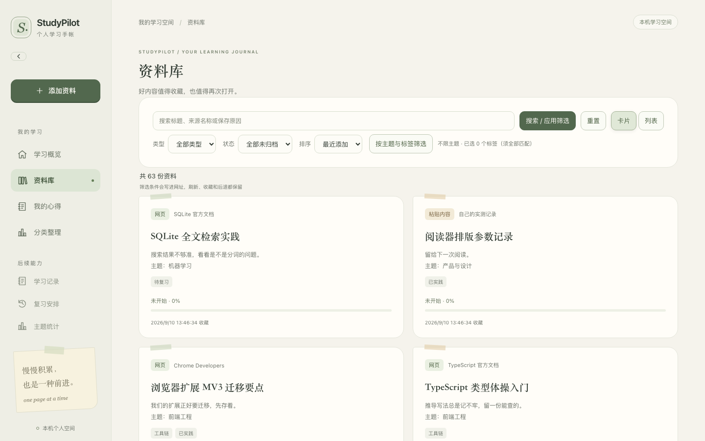
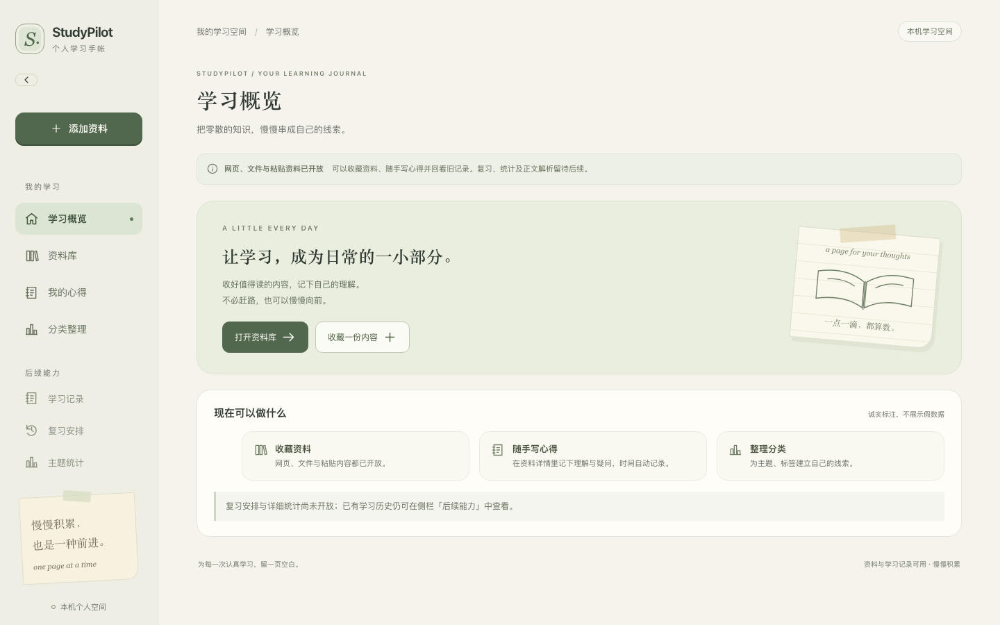
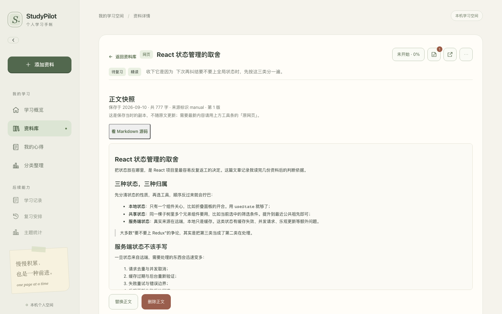
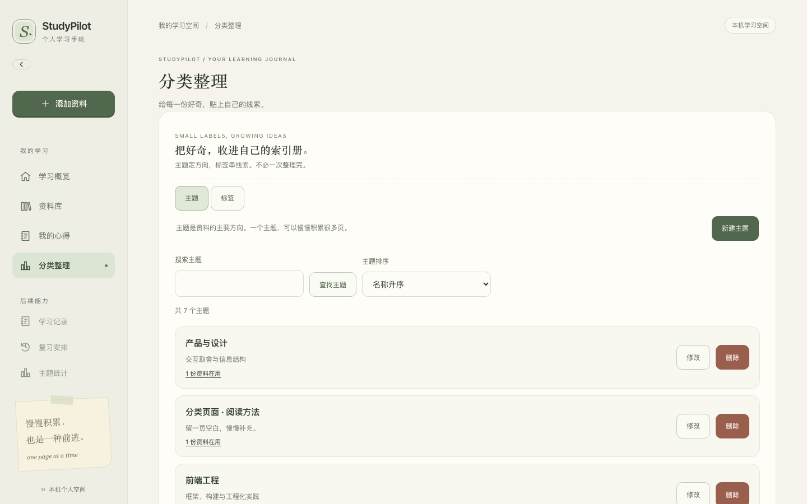
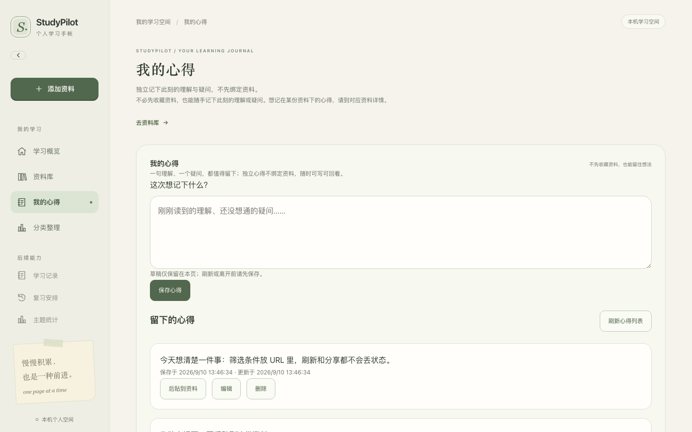
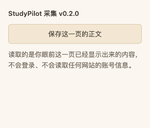

# StudyPilot

**面向个人学习者的本地优先阅读手帐。** 把网页、粘贴的内容和原始文件收进自己的资料库，冻结一份正文快照当文章读，再把心得写在资料旁边。

> **StudyPilot** is a local-first reading journal. A Chrome/Edge extension captures the article body of the page you are reading, the backend freezes it as a Markdown snapshot in a local SQLite database, and the frontend renders it as a distraction-free reader with your own notes alongside. Everything runs on `127.0.0.1` — no cloud, no account, no telemetry.

[](https://github.com/Yuklim/StudyPilot/actions/workflows/ci.yml)




---

## 这个项目做了什么

浏览器里读到好文章，通常的结局是「存进收藏夹，然后再也没打开过」。StudyPilot 想解决的是这个：**存下来的那一刻，就把正文留在本地**，之后不依赖原网站也能完整重读。

一条完整链路：

1. **采集** —— 在网页上点扩展图标，读当前页正文并转成 Markdown。页面有图片时会先问一次是否连图片一并保存，**不点确认就什么都不存**。
2. **确认** —— 打开 StudyPilot 确认页，核对标题与正文后保存为资料。保存下来的正文是一份**冻结快照**，之后原文改版、删除、失效都不影响阅读。
3. **阅读** —— 资料详情页是一个阅读器：正文居中、两层工具条（常用动作在常驻层，低频动作收进 `⋯`），右侧可展开心得侧栏。
4. **记录** —— 在资料旁写下理解、疑问和结论；也可以先随手写独立心得，之后再贴到某份资料上。

另外还有资料库的检索与筛选（类型、状态、排序、主题与标签，筛选条件写进 URL）、主题/标签管理（含使用情况统计与合并），以及保留的旧学习历史入口。

## 截图

| | |
| --- | --- |
|  **学习概览** —— 每天一小步的入口 |  **资料详情 = 阅读器** —— 冻结的正文快照、两层工具条 |
|  **分类整理** —— 主题与标签，含使用情况 |  **我的心得** —— 独立记录，可后贴到资料 |
|  **浏览器扩展 popup** —— 采集入口 |  **资料库** —— 卡片/列表、筛选进 URL |

> 以上截图取自真实运行的实例，数据为演示用途的合成内容。

## 技术栈

| 层 | 选型 | 说明 |
| --- | --- | --- |
| 后端 | Python 3.13 · FastAPI · SQLAlchemy 2 · Alembic · Pydantic | 分层为 `api` / `application` / `infrastructure` / `modules`；业务规则与框架解耦 |
| 数据库 | SQLite | 单文件、零运维；迁移用 Alembic 版本化（当前至 `0005`） |
| 前端 | React 19 · TypeScript · Vite · React Router | 组件测试用 Vitest + React Testing Library，端到端用 Playwright |
| 扩展 | Chrome/Edge MV3 · TypeScript · defuddle | 独立 npm 工程，不与 `frontend/` 共享依赖 |
| 质量 | Ruff · mypy(strict) · ESLint · Prettier · tsc | 见下方「测试与检查」 |
| 治理 | 自研检查器 + 多 Agent 流程 | 见下方「开发流程」 |

**没有引入的东西**：没有前端状态管理库、没有 UI 组件库、没有 ORM 之外的数据库抽象、没有 Markdown 渲染之外的 HTML 解析（正文渲染固定 `html: false`）。样式是手写的 CSS 变量体系。

## 架构

```
extension/  ──采集正文──▶  /capture 确认页  ──▶  ┐
                                                  ├─▶ FastAPI (/api/v1)  ──▶ SQLite
frontend/   ──同源代理 /api ─────────────────────┘        │
                                                          └─▶ 受控文件目录（原始文件、快照图片、回收站）
```

几个刻意的取舍：

- **前端只访问同源 `/api`**，后端端口不写死在任何组件里；
- **本机访问门禁**：只信任 `127.0.0.1` + 精确端口的 Host、校验来源上下文、每次启动轮换内存令牌。未授权请求在读取正文或触碰文件/数据库**之前**就被拒绝；
- **后端全程不出网**：不抓取、不下载远程资源。扩展侧取图片字节时只向用户显式授权过的站点请求，且只经既有中转通道交给前端上传；
- **快照是副本不是引用**：同一份资料重新保存会整体替换快照，不做增量拼接。

更完整的设计说明见 [`docs/architecture/MVP架构与技术选型提案.md`](docs/architecture/MVP架构与技术选型提案.md)，接口与数据契约为 [`docs/contracts/`](docs/contracts/)。

## 快速开始

需要 **Python 3.13**（用 [uv](https://docs.astral.sh/uv/) 管理）、**Node.js 24 LTS** 与 **npm 11**。仓库用 `.python-version` / `.node-version` 与两份锁文件固定版本。

```bash
# 1. 安装依赖
cd backend && uv sync --locked && cd ..
cd frontend && npm ci && cd ..

# 2. 建库并启动后端（第一个终端）
cd backend
uv run alembic upgrade head
uv run uvicorn studypilot.main:app --host 127.0.0.1 --port 8000 --no-access-log

# 3. 启动前端（第二个终端）
cd frontend && npm run dev
```

打开 <http://127.0.0.1:5173> 即可。后端健康检查在 <http://127.0.0.1:8000/health>。

> 只想看界面而不建库也可以：前端仍能打开概览页，但资料相关页面会明确报错而不是显示假数据。

浏览器扩展是独立工程：

```bash
cd extension && npm ci && npm run build   # 产物在 extension/dist/
```

在 Chrome/Edge 的 `chrome://extensions` 打开开发者模式，选择「加载已解压的扩展程序」并指向 `extension/dist/`。

详细的安装排错、环境变量、数据库配置与常见问题，见 **[docs/开发与运行.md](docs/开发与运行.md)**。

## 测试与检查

全部为真实执行结果，对应基线 `f609145`：

| 套件 | 命令 | 结果 |
| --- | --- | --- |
| 后端 | `cd backend && uv run pytest` | **550 passed** |
| 前端组件 | `cd frontend && npm run test -- --run` | **539 passed**（23 个文件） |
| 浏览器扩展 | `cd extension && npm run test -- --run` | **145 passed**（8 个文件） |
| 端到端 | `cd frontend && npm run test:e2e` | Playwright 驱动真实浏览器，覆盖资料、分类、心得、文件与阅读器 |

除测试外，每个模块还有静态检查：后端 Ruff + mypy（`strict = true`）、前端与扩展各跑 Prettier + ESLint + `tsc --noEmit`。端到端测试启动一个**隔离沙盒**——临时数据库、临时文件目录、独立端口（后端 18000 / 前端 15173），跑完即删，不碰本机真实数据。

CI 在每次 push 与 PR 上跑同一组命令，见 [`.github/workflows/ci.yml`](.github/workflows/ci.yml)。

## 项目结构

```
backend/       FastAPI 后端（api / application / infrastructure / modules 分层）
  migrations/  Alembic 版本化迁移
  tests/       pytest（含共享 fixture 与 Playwright 用的沙盒启动器）
frontend/      React + TypeScript 前端
  src/features/  按功能切分的页面与组件
  e2e/           Playwright 端到端测试
extension/     Chrome/Edge MV3 扩展（独立 npm 工程）
docs/          架构、契约、治理规则与任务记录
scripts/       仓库治理检查工具
```

## 开发流程：多 Agent + 风险分级

这个仓库的另一半内容是**工程流程本身**——它是一个用 AI Agent 协作开发的项目，并且把协作规则写成了可执行的约束，而不只是口头约定。

- **[`AGENTS.md`](AGENTS.md)** 是权威协作规则：每个任务一个分支、一个唯一写入者、一份任务记录；
- **风险分级（L1/L2/L3）** 决定执行链。L2/L3 需要**独立于实现者的只读 Reviewer** 审最终 diff，L3 还要独立验收；规则明确禁止把自评当成独立审查；
- **审查者权限由运行器强制**，不是靠约定：`.claude/agents/reviewer.md` 只授予读工具；
- **规则不能靠自觉**，能在系统层兜底的都写了权限拒绝（见 `.claude/settings.json`），例如禁止直接推送/合并 `main`、禁止 `reset --hard`；
- **[`scripts/governance/check_task.py`](scripts/governance/check_task.py)** 按变更路径自动选出该跑哪些检查组，缺少工具、测试失败或未执行都不会被当成通过。

`docs/tasks/` 保留了 **59 份任务记录**（TASK-000 ~ TASK-047，早期任务另附 HANDOFF / REVIEW / ACCEPTANCE），记录每个任务的需求、实现、真实检查输出与审查结论，包括失败与返工。想了解这套流程怎么运转，可以从 [`docs/governance/多Agent开发制度使用指南.md`](docs/governance/多Agent开发制度使用指南.md) 和任务索引 [`docs/tasks/任务索引.md`](docs/tasks/任务索引.md) 读起。

> 这些是开发过程材料，不是使用本项目所需的前置阅读。只想用或只想读代码的话，忽略 `docs/tasks/` 即可。

## 已知边界

这个项目在**诚实标注未完成部分**上比较刻意，以下几点是真实限制而非待办装饰：

- **不支持公开部署**。本机访问门禁是围绕 `127.0.0.1` 设计的，没有账号体系、没有多用户隔离；不要把监听地址改成 `0.0.0.0`。
- **复习、统计与 AI 尚未开放**。相关页面会明确显示「未接入」而不是填零。资料库为空时也不会显示示例数据冒充真实内容。
- **未冻结的图片会按原址加载**。如果一份快照里的图片当时没有随正文一起冻结，阅读时会直接向原网站请求（已加 `referrerpolicy="no-referrer"` 缓解，但原网站仍能看到你的 IP）。
- **搜索只覆盖标题、来源名称与保存原因**，不搜正文。
- **扩展只支持 Chromium 系**（Chrome / Edge），不支持 Firefox 与 Safari。
- 一次采集最多处理 60 张图片，超出的图片在提取阶段即被截断，确认页不会提及。

## 文档索引

| 文档 | 内容 |
| --- | --- |
| [`docs/开发与运行.md`](docs/开发与运行.md) | 详细安装、启动、环境变量、数据库配置、全部检查命令与常见问题 |
| [`docs/architecture/`](docs/architecture/) | 架构与技术选型提案 |
| [`docs/contracts/`](docs/contracts/) | API 与数据契约基线（含 `openapi-v1.json`） |
| [`docs/research/`](docs/research/) | 阅读器与标注能力的调研 |
| [`docs/governance/`](docs/governance/) | 多 Agent 协作制度、风险分级与检查规则、模板 |
| [`docs/tasks/`](docs/tasks/) | 全部任务记录与索引 |

## License

[MIT](LICENSE)
